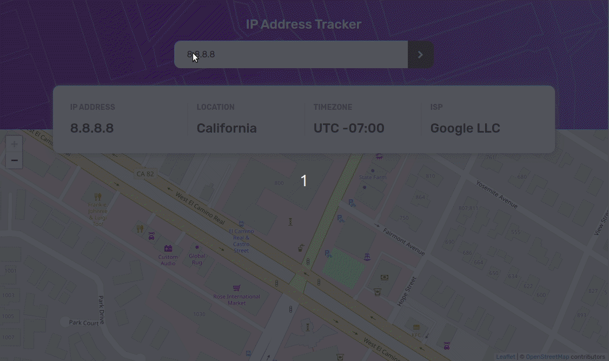

# Frontend Mentor - IP address tracker solution

This is my solution to the [IP address tracker challenge on Frontend Mentor](https://www.frontendmentor.io/challenges/ip-address-tracker-I8-0yYAH0). Frontend Mentor challenges help you improve your coding skills by building realistic projects.

## Table of contents

- [Overview](#overview)
  - [The challenge](#the-challenge)
  - [Screenshot](#screenshot)
  - [Links](#links)
- [My process](#my-process)
  - [Built with](#built-with)
  - [What I learned](#what-i-learned)
  - [Continued development](#continued-development)
  - [Useful resources](#useful-resources)
- [Author](#author)
- [Acknowledgments](#acknowledgments)

## Overview

### The challenge

Users should be able to:

- View the optimal layout for each page depending on their device's screen size
- See hover states for all interactive elements on the page
- See their own IP address on the map on the initial page load
- Search for any IP addresses and see the key information and location

### Screenshot

### Links

- [Solution URL](https://www.frontendmentor.io/solutions/ip-address-tracker-lFLWtnjYT)
- [Live Site URL](https://fem-ip-address-tracker.herokuapp.com/)

## My process

### Built with

- SASS (CSS Preprocessor)
- Fastify

### What I learned

This is my first project with SASS, yay :) So far I have pleasant experience using it. The selector nesting wasn't new as I have been using styled-components to date. But I'm looking forward to using @mixin and @function.

## Author

- Website - [Personal Web](https://krishnarowter.com)
- Frontend Mentor - [@krowter](https://www.frontendmentor.io/profile/krowter)
